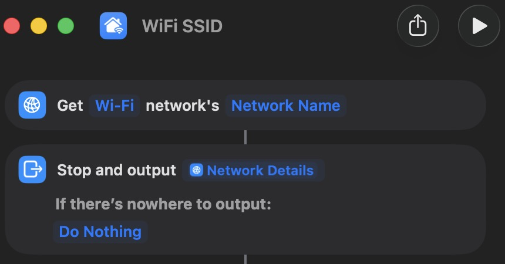

# 📶 WiFi SSID Plugin

> Displays your current WiFi network name in the macOS menu bar — and updates **instantly** when your network changes.

---

## 🤔 Why this exists

SwiftBar plugins normally refresh on a timer. For something as dynamic as WiFi, polling every 30 seconds means you're often staring at a stale network name. This plugin solves that by using a `launchd` watcher that fires the moment macOS detects a network change — no unnecessary polling, no stale data.

> **Note:** SwiftBar has no native WiFi event trigger (despite what some docs suggest). This setup uses a `launchd` watcher on `/var/run/resolv.conf` — a file macOS updates on every network change — to trigger a SwiftBar refresh via its URL scheme. It's a workaround, but it works reliably.

---

## 📁 Files

| File | Description |
|---|---|
| `wifi-ssid.sh` | SwiftBar plugin — runs a Shortcut to get the WiFi SSID |
| `wifi-watcher.sh` | Watcher script — triggered by launchd on network changes |
| `com.user.wifiwatcher.plist` | launchd plist — watches `/var/run/resolv.conf` for changes |

---

## 🚀 Installation

### 1. Copy the plugin files

```bash
cp wifi-ssid.sh ~/swiftbar-plugins/
cp wifi-watcher.sh ~/swiftbar-plugins/
```

### 2. Make scripts executable

```bash
chmod +x ~/swiftbar-plugins/wifi-ssid.sh
chmod +x ~/swiftbar-plugins/wifi-watcher.sh
```

### 3. Create the Shortcut

This plugin uses a macOS Shortcut called **"WiFi SSID"** to retrieve the current network name.



1. Open the **Shortcuts** app
2. Create a new Shortcut named `WiFi SSID`
3. Add the **Get Network Details** action and set it to return **Network Name**

### 4. Install the launchd watcher

```bash
# Copy the plist to LaunchAgents
cp com.user.wifiwatcher.plist ~/Library/LaunchAgents/

# Load it
launchctl load ~/Library/LaunchAgents/com.user.wifiwatcher.plist
```

### 5. Refresh SwiftBar

Right-click the SwiftBar menu bar icon → **Refresh All**. Your WiFi name should now appear! 🎉

---

## 🔄 How it works

```
Network changes
      ↓
macOS updates /var/run/resolv.conf
      ↓
launchd detects the file change
      ↓
wifi-watcher.sh runs
      ↓
SwiftBar refreshes the wifi-ssid plugin via URL scheme
      ↓
Menu bar updates ✓
```

---

## 🗑 Uninstall

```bash
launchctl unload ~/Library/LaunchAgents/com.user.wifiwatcher.plist
rm ~/Library/LaunchAgents/com.user.wifiwatcher.plist
rm ~/swiftbar-plugins/wifi-ssid.sh
rm ~/swiftbar-plugins/wifi-watcher.sh
```

